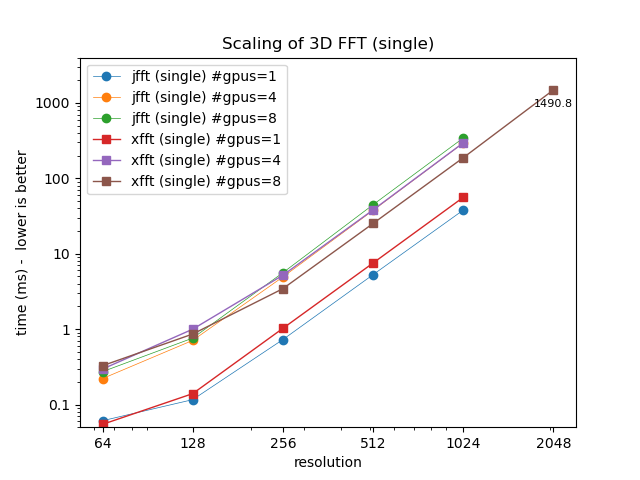
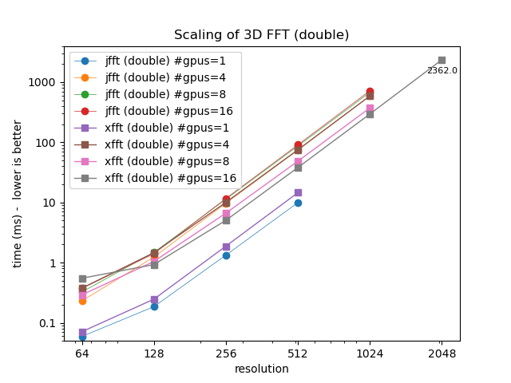

# xfft

Distributed 3D fft using JAX

Philip Mocz (2025)

Flatiron Institute

An example of scaling `jax.numpy.fft.fftn` to work in a distributed GPU setting, in pure JAX

TODO: turn this into a proper mini-library

## Virtual environment

```console
module purge
module load python/3.13
python -m venv --system-site-packages $VENVDIR/xfft-venv
source $VENVDIR/xfft-venv/bin/activate
pip install --upgrade pip
pip install -r requirements.txt
```

# Run locally

```console
python xfft.py --res 512
```

## Submit job (to Rusty)

```console
sbatch sbatch_rusty.sh 512
```

## Analyze results

```console
python analyze.py
```

# Summary




