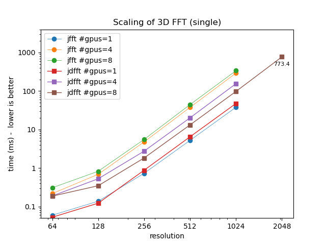
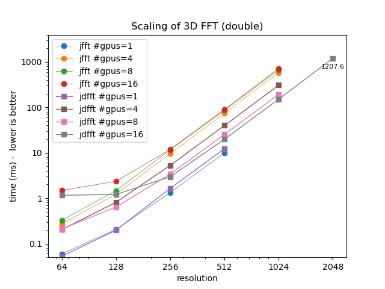

# xfft

Distributed 3D fft using JAX

Philip Mocz (2025)

Flatiron Institute

Comparing
`jax.numpy.fft.fftn`,
my decomposed version,
and `jaxdecomp` (as of Aug 25, 2025, this only works up to jax v0.5.3)


## Virtual environment

```console
module purge
module load python/3.11
python -m venv --system-site-packages $VENVDIR/jdfft-venv
source $VENVDIR/jdfft-venv/bin/activate
pip install --upgrade pip
pip install -r requirements.txt
```

# Run locally

```console
python xfft.py --res 512
```

## Submit job (to Rusty)

```console
sbatch sbatch_rusty.sh 512
```

## Analyze results

```console
python analyze.py
```

# Summary




